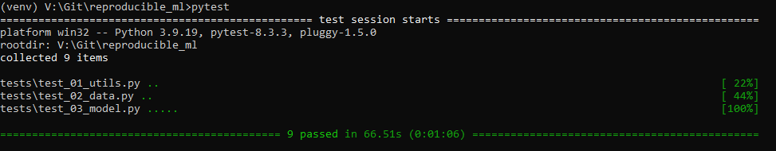

# Reproducible Deep Learning Pipeline for MNIST Dataset

This repository is the final project for the **Building Reproducible Analytical Pipelines** course, taught by **Prof. Dr. Bruno Rodrigues** at the University of Luxembourg. 

Author: **Anton Zaitsev**

## Overview

This repository demonstrates how to build a reproducible pipeline where we extract some data, train a deep learning model and evaluate it. The goal is to ensure that results, such as accuracy in our case, can be consistently reproduced.

For example, imagine a scenario where someone publishes a research paper on a machine learning algorithm with promising results. Naturally, others would want to examine the code and reproduce the same results as the authors' to validate their claims. This is exactly what we achieve in this repo by following best practices for reproducibility in DL pipelines. Generally, the pipeline is as follows:
1. Load the dataset (training and testing data).
2. Train a deep learning model.
3. Evaluate the model using a metric.

For reproducibility to hold, the following criteria are maintained:
1. Random seed: Consistent PyTorch random seed for deterministic behavior.
2. Dataset: Identical training and testing data, including batch size.
3. Data preprocessing: Fixed standardization parameters (mean and standard deviation).
4. Model architecture: Consistent neural network structure.
5. Training setup: Fixed number of training epochs, loss function and optimizer (all hardcoded in the training process).

## Repository Structure

- `data/`: Contains the MNIST dataset and functions for data loading and preprocessing.
- `model/`: Stores pretrained models, model architecture definitions, fucntions for training and evaluation.
- `tests/`: Includes unit tests for global variables and functions to ensure reproducibility.
- `utils/`: Contains global variables and helper functions.
- `main.py`: Runs training and evaluation. Outputs the final train and test accuracies and step results.

## How to Use

**Important**: Python version used: `3.9.19`

1. Clone the repository:
```
git clone https://github.com/ztsv-av/reproducible_ML
cd reproducible_ML
```
2. Create a virtual environment (recommended):
```
python -m venv venv
source venv/bin/activate # On Linux/Mac
venv\Scripts\activate    # On Windows
```
3. Install dependencies:
```
pip install -r requirements.txt
```
4. Run tests to verify reproducibility:
```
pytest
```
5. Run the pipeline:
```
python main.py
```

If everything is correct, the output after running `pytest` should be as follows:


